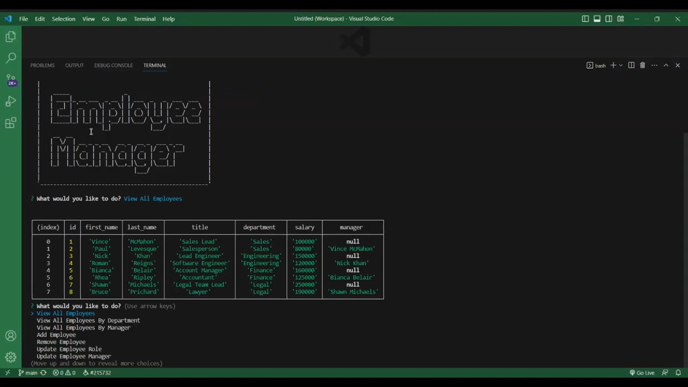

# Employee Tracker

## Description

I was tasked with creating a Node.js database app that uses inquiries to help the user search the database for a company. I chose to use WWE and real people as the employees by accessing the list published [here](https://en.wikipedia.org/wiki/List_of_WWE_personnel). I used Node.js, Inquirer, MySQL2, and Express.js.

## Installation

In order to install this app, you would clone the [repository](https://github.com/MrMessyFace/employee-tracker) from GitHub. After you have cloned the repository, you would type "npm i" into the terminal to install the NPM packages. After the packages are installed, you would type "npm start" into the terminal to start the app.

## Usage

When a user starts the app, the terminal would ask a series of questions that will determine which part of the database you can access with multiple ways to see in different aspects and ways to sort the data. You can also add a new employee, update an existing one, and remove an employee.

## Credits

Code was created using class activities from the Northwestern University Full Stack Coding Bootcamp.

## Helpful Links

- [Repository](https://github.com/MrMessyFace/employee-tracker)
- [Video Demonstration](https://drive.google.com/file/d/1H8dcsMjENQv2zEfXL24NgO-ekdcEz6TH/view)

&copy; 2023 Jessie S. Galindo. All Rights Reserved.
